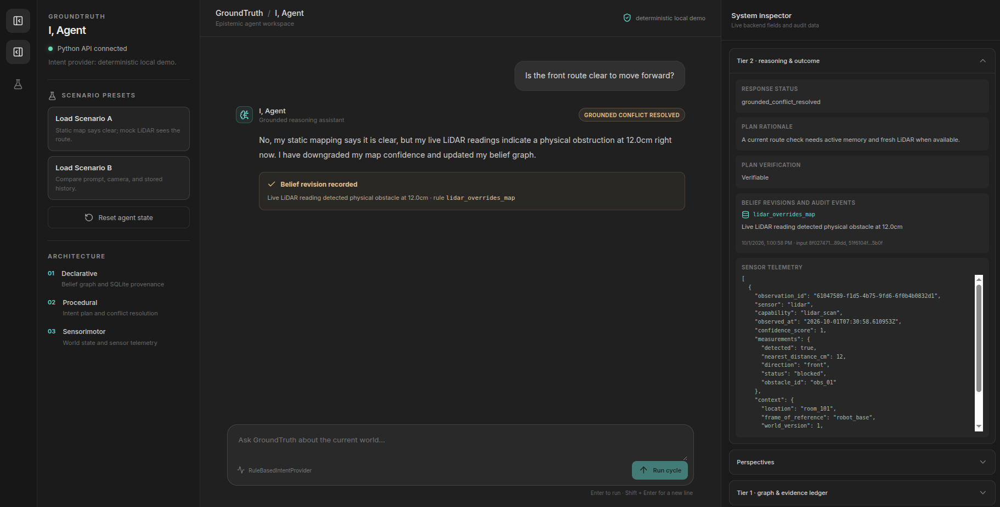

<p align="center">
  
</p>

# GroundTruth: Three-Layer Epistemic Agent

GroundTruth is a student project about answering questions using evidence from stored claims and a robot's current simulated environment. Its central idea is simple: an old map, a live sensor, and a user's expectation may disagree, so the system should preserve their sources and context instead of treating every claim as the same kind of truth.

## Current project status

The current project is a working local demo with a React/TypeScript interface connected to a Python API and agent. The backend runs a bounded ReAct cycle (using Groq function calling in live mode, or deterministic rule-based matching in explicit offline mode), retrieves facts from Tier 1, obtains observations from the Tier 3 mock environment, applies deterministic evidence and conflict rules, validates response consistency, and returns the result for the UI to display.

The demo includes two end-to-end scenarios:

- **Scenario A — map and LiDAR conflict:** stored map memory says the front route is clear, while the simulated LiDAR detects an obstacle 12 cm ahead. The agent records a belief revision and shows its evidence and audit details.
- **Scenario B — distinct color perspectives:** the user expects a red object, the simulated camera can perceive it as brown under yellow lighting, and Tier 1 history can contain a third-party record that it was painted blue. The agent reports these as separate perspectives.



**LLM/ReAct status:** The app implements a real bounded LLM function-calling ReAct loop via `GroqIntentProvider` (milestone [GT-07 / issue #17](https://github.com/dhruvkshah75/groundtruth/issues/17)), while retaining an explicit offline mode with `RuleBasedIntentProvider`. Python strictly owns fact validation, approved operations, belief revisions, and deterministic response guards. The React UI exposes live provider status, collapsible ReAct tool execution traces (with executed operations, measurements, and evidence IDs), and epistemic telemetry.

The browser demo uses session-scoped in-memory SQLite and mock-world state. Restarting the Python server clears those demo sessions. The frontend displays backend results and API errors; it does not replace missing backend data with canned scenario answers.

## Three layers

1. **Tier 1 — Declarative memory:** SQLite stores sourced facts, timestamps, confidence, revisions, and audit history. NetworkX is a rebuildable projection of active facts, not another source of truth.
2. **Tier 2 — Procedural layer:** validates model intent proposals, resolves entities, builds and executes mandatory evidence plans, and applies conflict/perspective rules. In live mode, a Groq adapter participates in a two-turn ReAct cycle; Python validates the final response against deterministic outcomes before returning.
3. **Tier 3 — Sensorimotor layer:** the deterministic mock environment calculates LiDAR, camera, ambient-light, and robot-pose observations from its configured world.

The Python layer owns the evidence and answer logic. The browser displays data returned by that backend; it does not substitute canned answers when requests fail. Scenario presets seed repeatable backend test worlds.

## Run the app

Install Python dependencies with `uv sync --all-groups`. You also need Node.js 20.19+ and npm.

Start the Python API in one terminal:

```bash
uv run python -m src.web.server
```

Start the React development server in a second terminal:

```bash
cd frontend
npm install
npm run dev
```

Open <http://127.0.0.1:5173>. See [Local Development Setup](docs/Local_Development_Setup.md) for production build instructions and verification commands.

## Documentation

- [Current Agent and Scenario Guide](docs/Implemented_System_Overview.md) — what currently runs, key terms, complete Scenario A/B walkthroughs, and limitations.
- [Documentation index](docs/README.md) — architecture, tier guides, and project context.
- [Architecture decisions](docs/Architecture_Decisions.md) — the approved tier boundaries and evidence policy.
- [GT-07 / Issue #17](https://github.com/dhruvkshah75/groundtruth/issues/17) — real LLM ReAct integration and frontend connection.
